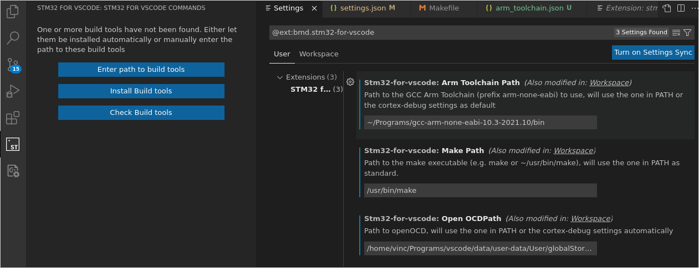

# Install

## Ubuntu

- Download `.tar.gz` version of [VSCode](https://code.visualstudio.com/download) and unzip with `tar -zxvf` to convenient location.
- Create `data` folder in VSCode folder to keep VSCode in portable mode.
- Start VSCode by cd'ing into `bin` and running `. code`
- Fork github repo and checkout locally, then open folder in VSCode
- Go to Extensions (`CTRL + SHIFT + X`) and install `stm32-for-vscode`
  
- On the left side click the new `ST` icon and then on `Enter path to build tools`
  
- Download correct standalone `Arm Toolchain` from [link](https://developer.arm.com/downloads/-/gnu-rm).
  Then unpack to convenient `<path>` and enter path as `<path>/bin`
- Install `make` globally by running `sudo apt install make`, then 
 check make location by running `whereis make` and enter path into build tools
- Download correct `OpenOCD` from [link](https://github.com/xpack-dev-tools/openocd-xpack/releases).
  Then unpack to convenient `<path>` and enter path as `<path>/bin/openocd`
- (**) Make sure everywhere in the project configuration the paths are set as expected
- You should be able to build now
  
